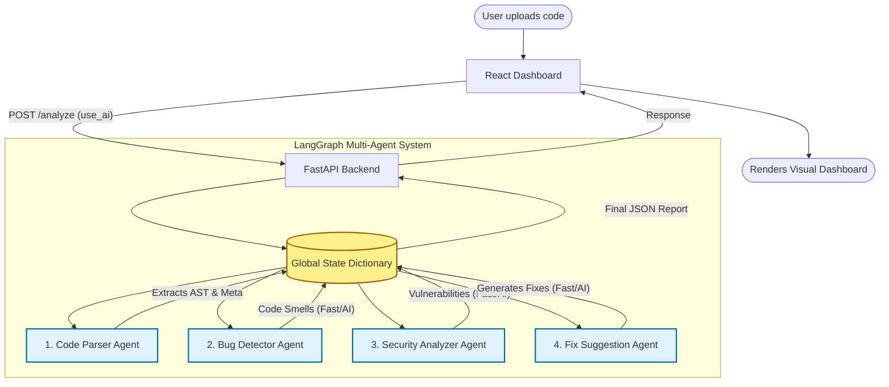

# AI Code Review & Bug Detection System
## Multi-Agent System Architecture

This document provides a comprehensive overview of the Multi-Agent System (MAS), detailing the orchestration workflow, the specialized agents, and the deterministic production tools they use to perform deep code inspection.

---

## 🏗️ Overall Workflow & Architecture

The system operates as a full-stack, local-first application where the React frontend communicates with the LangGraph MAS backend via FastAPI. The backend orchestrates four autonomous agents in a sequential pipeline. Instead of passing massive strings back and forth, the agents share and mutate a global **State Dictionary**.

### End-to-End Workflow Diagram

### Workflow Steps:
1. **Initiation**: The user uploads or pastes code into the React UI and chooses to enable or disable **Deep AI Analysis**.
2. **State Creation**: A LangGraph state is initialized holding the raw code, the `use_ai` flag, and empty lists for findings.
3. **Agent Orchestration**: The pipeline sequentially executes each agent. 
   - If `use_ai` is **False**, agents strictly use deterministic, rule-based execution engines (AST/Regex) for instantaneous feedback.
   - If `use_ai` is **True**, agents query the local `llama3:8b` model for deep, contextual code enhancements.
4. **Finalization**: The Fix Suggestion Agent compiles all issues, formats actionable fixes, and generates a unified `final_report`.
5. **Delivery**: The JSON report is returned to the frontend where it is dynamically rendered into specialized, color-coded tabs.

---

## 🤖 1. Code Parser Agent
**Purpose:** 
The foundational agent. It safely reads the target source code from the user's filesystem and uses Abstract Syntax Tree (AST) mapping to understand the code's structural metadata before any deep analysis begins.

**Tools Used:**
* `tools/file_reader.py`: A robust file-reading tool that features strict file-size limits, encoding detection (UTF-8, Latin-1, CP1252 fallbacks), and secure path resolution to prevent system crashes.
* `ast`: Python's built-in AST library to extract exactly how many classes, functions, and imports exist.

**Output to State:** Populates `code_content` and `parsed_data`.

---

## 🐛 2. Bug Detector Agent
**Purpose:** 
Acts as the static code quality inspector. It looks for logic mistakes, code smells, bad practices, and violations of clean code principles (like PEP-8).

**Tools Used:**
* `tools/code_analyzer.py`: A specialized rule-checking engine that traverses the AST to calculate cyclomatic complexity and pinpoint exact line numbers for:
    * Unused variables
    * Excessively long functions
    * Too many parameters in a function signature
    * Deeply nested `if/for/while` loops
    * Bad naming conventions (e.g., using PascalCase for standard variables)
    * Duplicate logic

**Output to State:** Populates the `bugs` array and updates the complexity score.

---

## 🛡️ 3. Security Analyzer Agent
**Purpose:** 
Acts as the cybersecurity auditor. It scans the raw codebase specifically for severe vulnerabilities that could be exploited in a production environment.

**Tools Used:**
* `tools/security_tool.py`: A custom security scanning engine utilizing advanced Regex patterns and risk-scoring algorithms to detect OWASP vulnerabilities, including:
    * **SQL Injection:** Unsafe string formatting inside database queries (e.g., `f"SELECT * FROM users WHERE id={uid}"`).
    * **Command Injection:** Unsafe OS interactions (e.g., `os.system()`, `subprocess`).
    * **Hardcoded Secrets:** API keys, AWS tokens, and passwords left in plain text.
    * **Unsafe Execution:** Malicious code execution points like `eval()` or `exec()`.
    * **Leftover Debugging:** Things like `breakpoint()` or `pdb.set_trace()` left in the code.

**Output to State:** Populates the `security_issues` array with high/medium/low risk assignments.

---

## 🔧 4. Fix Suggestion Agent
**Purpose:** 
The aggregator and problem solver. It reviews everything found by the Bug Detector and Security Analyzer agents, sorts them by critical severity, and constructs exact, actionable code replacements for the developer.

**Tools Used:**
* `tools/fix_engine.py`: A dedicated remediation engine that utilizes a comprehensive mapping of vulnerabilities to optimal, secure programming paradigms (e.g., substituting string-formatted SQL queries with parameterized database connectors).

**Output to State:** Populates the `fixes` array and finalizes the `summary` block to complete the LangGraph execution.
